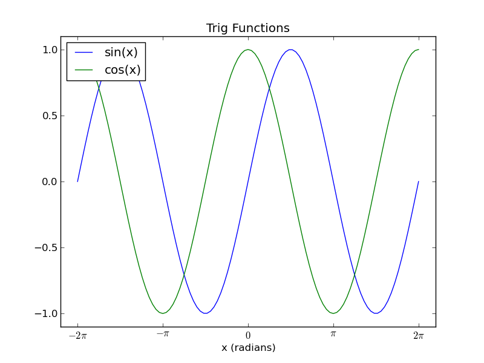

Approximating Sine and Cosine functions using Taylor Series
-----------------------------------------------------------

In this example, we calculate an approximation of the cosine functions using
the `Taylor series <http://en.wikipedia.org/wiki/Taylor_series>`_:

.. math::

    \cos (x) = \sum_{n=0}^{\infty} \frac{(-1)^n}{(2n)!} x^{2n}

The following example uses the Taylor Series approximation to generate the Sine
and Cosine functions. Successive terms of the taylor series are calculated
until successive approximations agree to within a small degree. A Sine
function is also synthesised using the identity :math:`sin(x) \equiv cos(x-\pi/2)`

.. code-block:: c

    /* taylor.c */
    /* Jonathan P Dawson */
    /* 2013-12-23 */
    
    /* globals */
    double pi=3.14159265359;
    
    /* approximate the cosine function using Taylor series */
    
    double taylor(double angle){
    
        double old, approximation, sign, power, fact;
        unsigned count, i;
    
        approximation = angle;
        old = 0.0;
        sign = -1.0;
        count = 1;
        power = 1.0;
        fact = 1.0;
    
        for(i=3; approximation!=old; i+=2){
            old = approximation;
    
            while(count<=i){
                power*=angle;
                fact*=count;
                count++;
            }
    
            approximation += sign*(power/fact);
            sign = -sign;
    
        }
        return approximation;
    }
    
    
    /* return the sine of angle in radians */
    
    double sin(double angle){
    
        return taylor(angle);
    
    }
    
    /* return the cosine of angle in radians */
    
    double cos(double angle){
        
        return sin(angle+(pi/2));
    
    }
    
    
    /* test routine */
    
    void main(){
        double x;
        double step=pi/25;
    
        for(x=-2*pi; x <= 2*pi; x += step){
           file_write(x, "x");
           file_write(cos(x), "cos_x");
           file_write(sin(x), "sin_x");
        }
    }

A simple test calculates Sine and Cosine for the range :math:`-2\pi <= x <= 2\pi`.

