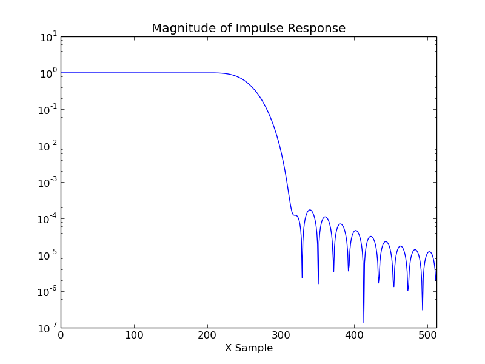

FIR Filter
----------

An FIR filter contains a tapped delay line. By applying a weighting to each
tap, and summing the results we can create a filter. The coefficients of the
filter are critical. Here we create the coefficients using the firwin function
from the SciPy package. In this example we create a low pass filter using a
Blackman window. The Blackman window gives good attenuation in the stop band.

The C code includes a simple test routine that calculates the frequency
spectrum of a 64 point sine wave.

.. code-block:: c

    /* Chips-2.0 FIR Filter Example */
    /* Jonathan P Dawson 2014-07-05 */
    
    #include <stdio.h>
    
    unsigned in = input("a");
    unsigned out = output("z");
    unsigned kernel_in = input("k");
    
    void fir_filter(){
        unsigned i = 0;
        unsigned inp = 0;
        float delay[N];
        float kernel[N];
        float data_out;
    
        /* read in filter kernel */
        for(i=0; i<N; i++){
           kernel[i] = fget_float(kernel_in);
        }
    
    
        /* execute filter on input stream */
        while(1){
            delay[inp] = fget_float(in);
            data_out=0.0; i=0;
            while(1){
                data_out += delay[inp] * kernel[i];
                if(i == N-1) break;
                i++;
                if(inp == N-1){
                    inp=0;
                }else{
                    inp++;
                }
            }
            fput_float(data_out, out);
        }
    }

Increasing the length of the filter kernel results in a faster roll-off and
greater attenuation.

While in this example, we calculate all the coefficients inside a single
process, it is possible to generate a pipelined implementation, and allow the
work to be carried out by multiple processes resulting in an increase in the
throughput rate.

`The Scientist and Engineer's Guide to Digital Signal Processing <http://www.dspguide.com/>`_ 
gives a straight forward introduction, and can be viewed on-line for free. 

